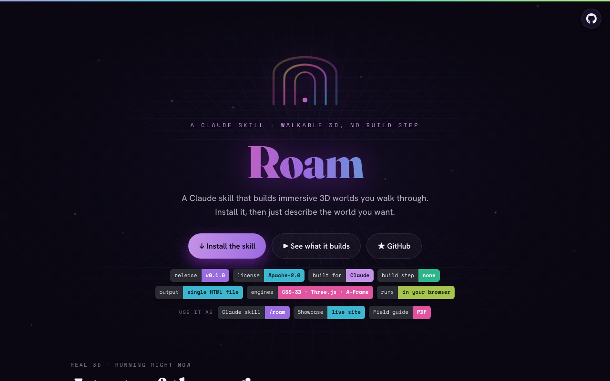
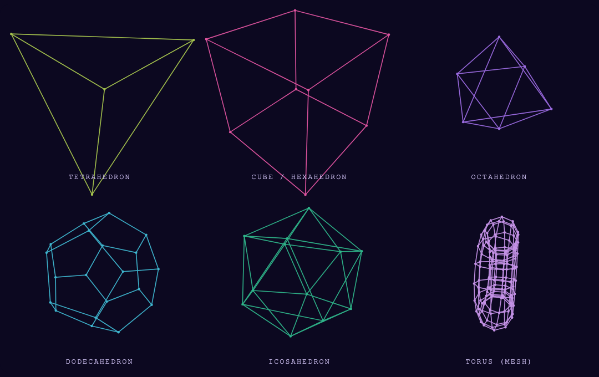
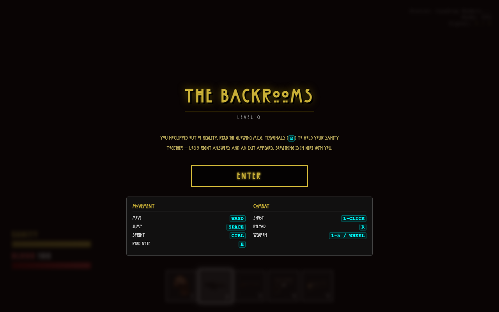

# Roam — a Claude skill for walkable 3D

**Roam** is a [Claude](https://claude.com/claude-code) skill for building immersive 3D worlds you walk through — scroll-driven corridors and true first-person rooms — each a single HTML file with **no build step**. Install it on your own Claude, then just describe the world you want.

🔗 **Live showcase:** https://wuisabel-gif.github.io/roam/

> ⚠️ Early prototype — expect rough edges as the skill grows.

## A look inside

The showcase — install, see what it builds, and a live geometry demo:



Real-time wireframe geometry — the Three.js engine Roam builds on (the five Platonic solids + a torus mesh):



A world it builds — the Backrooms, Level 0:



## Install on your Claude

Clone this repo straight into your skills folder:

```bash
git clone https://github.com/wuisabel-gif/roam.git ~/.claude/skills/roam
```

No git? [Download the repo](https://github.com/wuisabel-gif/roam) and copy the folder to `~/.claude/skills/roam`.

Then **restart Claude** and ask:

```
Use the roam skill to build a walkable 3D museum of my photography.
```

…or type `/roam`. Claude reads `SKILL.md` for the technique and `references/recipes.md` for copy-paste code.

## What it builds

Two tracks, both single-file and dependency-light:

- **CSS-3D corridor** — turn any ordered list into a glowing doorway-lined hallway you scroll through (flip-for-info cards, HUD, end handoff). Zero dependencies.
- **Three.js first-person rooms** — a real room you walk with WASD + mouse-look: GLB furniture, tileable textures, and rooms you step inside *behind paintings*. Loaded from a CDN importmap — still no build.

## Worlds made with it

| World | Live |
|---|---|
| **Kpop Crush — The Hall of Eras** (CSS-3D corridor) | https://wuisabel-gif.github.io/kpop-crush/ |
| **The College Playbook — Campus Walk** (A-Frame) | https://wuisabel-gif.github.io/university-of-spoiled-children/ |
| **Backrooms — Level 0** (WebGL) | https://wuisabel-gif.github.io/backroom_level_0/ |

## What's in this repo

- `SKILL.md` — the skill Claude follows (mental model, build order, dials, failure modes)
- `references/recipes.md` — copy-paste recipes (CSS-3D, A-Frame, Three.js no-build, advanced)
- `index.html` — the showcase site (this landing page)
- `roam-themes-and-examples.pdf` — the themes & example-prompts field guide

---

© 2026 [wuisabel-gif](https://github.com/wuisabel-gif) · licensed under [Apache-2.0](LICENSE)
